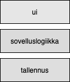
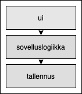
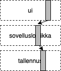
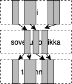

% Ohjelmistotuotanto
% Matti Luukkainen ja ohjaajat Kalle Ilves, Silva Perander, Topias Pyykönen, Jussi Laisi, Petrus Peltola, Kristian Krok
% syksy 2020
#  

&nbsp;&nbsp;&nbsp;&nbsp;&nbsp;&nbsp;&nbsp;&nbsp;&nbsp;&nbsp;&nbsp;&nbsp;&nbsp;&nbsp;&nbsp;&nbsp;&nbsp;&nbsp;&nbsp;&nbsp;&nbsp;&nbsp;&nbsp;&nbsp;&nbsp;&nbsp;&nbsp;&nbsp;&nbsp;&nbsp;&nbsp;&nbsp;&nbsp;&nbsp;&nbsp;&nbsp;&nbsp;Luento 5

&nbsp;&nbsp;&nbsp;&nbsp;&nbsp;&nbsp;&nbsp;&nbsp;&nbsp;&nbsp;&nbsp;&nbsp;&nbsp;&nbsp;&nbsp;&nbsp;&nbsp;&nbsp;&nbsp;&nbsp;&nbsp;&nbsp;&nbsp;&nbsp;&nbsp;&nbsp;&nbsp;&nbsp;&nbsp;&nbsp;&nbsp;&nbsp;&nbsp;&nbsp;&nbsp;&nbsp;9.11.2020

# Miniprojektit lähestyvät

- 16.11. alkavalla viikolla
- ilmoittautuminen alkanut, päättyy perjantaina
- pakollinen, jos et hyväksilue


# Ohjelmistojen laadunhallinta

- Laadunhallinnan kaksi oleellista kysymystä
  - verifiointi: _are we building the product right_
  - validointi: _are we building the right product_

. . .
 
- Verifioinnissa varmistetaan, että ohjelmisto toteuttaa vaatimusmäärittelyn aikana asetetut vaatimukset
  - Testataan toiminnalliset ja ei-toiminnalliset vaatimukset

. . .

- Validointi: varmistetaan, että ohjelmisto täyttää käyttäjän odotukset
  - Vaatimusmäärittelyn aikana kirjatut vaatimukset eivät ole aina se mitä käyttäjä todella tarvitsee

# Verifiointi ja Validointi

- Tavoitteena on varmistaa että ohjelma on "riittävän hyvä"  käyttötarkoitukseensa
  - Hyvyys on suhteellista ja riippuu ohjelman käyttötarkoituksesta
  - Ohjelman ei yleensä tarvitse olla virheetön ollakseen riittävän hyvä käytettäväksi

. . .

- Verifioinnin ja validoinnin suorittamista käytetään yleisesti nimitystä _laadunhallinta_ (engl. quality assurance, QA)
- Jos laadunhallinta on erillisen tiimin vastuulla, käytetään tästä usein nimitystä _QA-tiimi_

# Verifioinnin ja Validoinnin tekniikat

- Verifioinnissa käytetään kahta erilaista tekniikkaa
  - Katselmointeja
  - Testausta

. . . 

- Katselmoinneissa (review) käydään läpi tuotantoprosessin aikana tehtyjä dokumentteja ja ohjelmakoodia, ja etsitään näistä ongelmia

. . .

- Katselmointi on _staattinen tekniikka_, suorituskelpoista ohjelmakoodia ei tarvita 
  - Jos katselmoinnin kohteena on ohjelmakoodi, ei sitä katselmoinnissa suoriteta

. . .

- Testaus on _dynaaminen tekniikka_, joka edellyttää ohjelmakoodin suorittamista 
  - tarkkaillaan miten ohjelma reagoi annettuihin testisyötteisiin

# Vaatimusten validointi

- Ohjelmistolle määritellyt vaatimukset on validoitava: 
  - varmistettava, että määrittelydokumentti määrittelee oikeanlaisen ohjelmiston

. . .

- Vesiputousmallissa määrittelydokumentin kirjattujen vaatimusten validointi suoritetaan  _katselmoimalla_

. . .

- Vaatimusmäärittelyn lopuksi asiakas tarkastaa vastaako määrittelydokumentti mielikuvaa tilattavasta järjestelmästä

. . .

- Katselmoinnin jälkeen määrittelydokumentti jäädytetään ja sen muuttaminen vaatii yleensä monimutkaista prosessia

# Vaatimusten ketterä validointi

- Ketterässä ohjelmistotuotannossa vaatimusten validointi tapahtuu sprinttien päättävien demonstraatioiden  yhteydessä

. . .

- Asiakkaalle näytetään ohjelman toimivaa versiota

. . .

- Asiakas voi itse verrata onko lopputulos haluttu
- Jos ei, on seuraavassa sprintissä mahdollista ottaa korjausliike

# Koodin katselmointi

- Koodin katselmointi eli lukeminen jonkun muun kuin ohjelmoijan toimesta on tehokas keino laadun parantamisessa

. . .

- Voidaan havaita koodista ongelmia, joita testaus ei havaitse
  - noudattaako koodi sovittua tyyliä
  - onko koodi ylläpidettävää
  - onko koodissa tietoturvan kannalta vaarallisia piirteitä

. . .

- Perinteisesti käyty läpi onko koodissa tiettyjä checklisteissä listattuja riskialttiita piirteitä

#

{ width=400 }


- Joissakin kielissä, esim. Javassa kääntäjän tuki tekee osan näistä tarkistuksista turhaksi

# Staattinen analyysi

- Nykyään on tarjolla katselmointia automatisoivia _staattista analyysiä_ tekeviä työkaluja 
  - Javalla Checkstyle 
  - Javascriptilla ESlint

. . .

- Myös pilvipalveluna toimivia työkaluja kuten Codeclimate
  - Suorittavat tarkastukset aina kun uutta koodia pushataan GitHubiin
  - Huomaavat koodin laadun muutoksista, esim. jos koodin kompleksisuus kasvaa muutosten yhteydessä 

# Koodin katselmointi: GitHub ja pull requestit

- GitHubin _pull requestit_ tarjoavat hyvän työkalun koodikatselmointiin 

. . .

- Työn kulku on seuraava
  - Sovelluskehittäjä forkkaa repositorin itselleen, tekee muutokset omaan repositorioon ja tekee pull requestin
  - Joku, esim. _senior developer_  tekee katselmoinnin pull requestille
  - Jos koodi ei ole riittävän hyvää, annetaan pull requestin tekijälle parannusehdotuksia
  - Muutosten ollessa hyväksyttäviä, pull request mergetään päärepositorioon

# Pullrequest TMC:hen

{ width=350 }

#

{ width=350 }

# Koodin katselmointi ketterissä menetelmissä

- Toisin kuin Scrum, eXtreme Programming eli XP määrittelee useita sovelluskehityksen käytänteitä
- Suuri osa XP:n käytänteistä on hyvin tunnettuja _best practiseja_, vietynä äärimmäiseen (extreme) muotoon

. . .

- Osa käytänteistä tähtää laadun maksimoimiseen, kolmen voidaan ajatella olevan katselmoinnin äärimmäinen muoto

# Pariohjelmointi

- _Pariohjelmoinnissa_ (pair programming) kaksi ohjelmoijaa työskentelee yhdessä samalla koneella

. . .

- Koodia kirjoittava osapuoli toimii _ohjaajana_ (driver) ja toinen _navigoijana_ (navigator) 
  - Roolia vaihdetaan sopivin väliajoin

. . .


- Navigoija tekee koodiin jatkuvaa katselmointia


# Pariohjelmoinnin etuja

- Parantaa ohjelmoijien kuria ja työhön keskittymistä

. . .

- Hyvä oppimisen väline
  - ohjelmoijat oppivat toisiltaan erityisesti noviisit kokeneimmilta, järjestelmän tietyn osan tuntee aina useampi ohjelmoija

. . .

- Todettu vähentävän bugien määrää 15-50%, kokonaisresurssin kulutus nousee hieman

# 


- Pariohjelmointi tai useamman ihmisen versio siitä, _mob-programming_ on melko yleistä
- "Määritelmän" mukaista systemaattista pariohjelmointia tehdään aika harvassa paikassa aamusta iltaan

. . .

- Yleensä ohjelmoidaan yksin, mutta spontaania pariutumista ja ryhmäytymistä tapahtuu
  - erityisesti teknisesti haasteellisissa koodin osissa 
  - tai jos kyse itselle tuntemattomasta osasta koodia

# Koodin katselmointi ketterissä menetelmissä

- _Koodin yhteisomistajuus_ (collective code ownership): kukaan yksittäinen ohjelmoija ei hallitse yksin mitään kohtaa koodista
  - Kaikilla lupa tehdä muutoksia mihin tahansa kohtaan koodia 

. . .

- Pariohjelmointi tukee yhteisomistajuutta
- Yhteisomistajuudessa on riskinsä: koodia tuntematon voi saada pahaa jälkeä aikaan
    - XP eliminoi riskejä testauksiin liittyvillä käytänteillä

. . .

- _Ohjelmointistandardi_ (coding standards): tiimi määrittelee koodityylin, johon kaikki ohjelmoijat sitoutuvat
  - Tyylillä tarkoitetaan nimeämiskäytäntöä, koodin muotoilua ja myös tiettyjä ohjelman rakenteeseen liittyviä seikkoja

. . .

- Noudattamista kontrolloidaan katselmoimalla sekä automaattisesti staattisen analyysin työkaluilla kuten checkstylellä 

# Testaus

- Ohjelmien osoittaminen virheettömäksi on mahdotonta

. . .

- Testauksen tarkoituksena vakuuttaa asiakas ja kehittäjät siitä, että ohjelmisto on _tarpeeksi hyvä_ käytettäväksi

. . .

- Testauksella on kaksi eriävää tavoitetta
  - osoittaa, että ohjelmisto täyttää sille asetetut vaatimukset
  - löytää ohjelmistosta virheitä

. . .

- Tähtää ohjelman _ulkoisen laadun_ (external quality) eli käyttäjän kokeman laadun parantamiseen
  - External Quality is the fitness for purpose of the software. 
  - It's most obvious measure is the Functional Tests, 
  - and some measure of the bugs that are still loose when the product is released.

# Testauksen tasot

{ width=400 }

#

- _Yksikkötestaus_ (unit testing)
  - Yksittäisten luokkien, metodien ja moduulien testaus erillään muusta kokonaisuudesta

. . .

- _Integraatiotestaus_ (integration testing)
  - Yksittäin testattujen komponenttien liittäminen yhteen eli integrointi ja kokonaisuuden testaus
 
. . .

- _Järjestelmätestaus_ (system testing)
  - Toimiiko ohjelmisto vaatimuksiin kirjatulla tavalla?
  - Jakautuu useisiin alalajeihin

. . .

- _Käyttäjän hyväksymistestaus_ (user acceptance testing)
  - Loppukäyttäjän tuotteelle suorittama testaus

# Järjestelmätestaus

- Tarkoitus varmistaa, että järjestelmä toimii vaatimuksiin kirjatulla tavalla
- Kehittäjäorganisaatio suorittaa järjestelmätestauksen

. . .

- Testaus tapahtuu yleensä ilman tietoa järjestelmän sisäisestä rakenteesta eli kyseessä _black box_ -testaus

. . .

- Testataan järjestelmää saman rajapinnan kautta, jonka kautta järjestelmää käytetään

. . .

- Perustuu järjestelmän potentiaalisiin käyttöskenaarioihin
  - user storyinä olevista vaatimuksista helppo muotoilla testejä
  - jos storyillä hyväksymiskriteeriot, tilanne on vieläkin parempi 

. . .

- Kutsutaan myös _toiminnallisiksi testeiksi_ (functional test)

. . .

- Toiminnallisen testauksen lisäksi järjestelmätestaukseen kuuluu
  - Käytettävyystestaus
  - Suorituskykytestaus 
  - Kuormitustestaus
  - Tietoturvan testaus

# Kuormitustestaus: ennen

{ width=400 }

# Kuormitustestaus: jälkeen

{ width=400 }

# Testitapausten valinta

- Kattava testaaminen on mahdotonta ja testaus työlästä
- Oleellista löytää kohtuullisen kokoinen _testitapausten joukko_, jonka avulla löytyy mahdollisimman suuri määrä virheitä

. . .

- Yksi _Testitapaus_ testaa toiminnallisuutta joillakin syötteillä 
- Useat syötteet ohjelmiston toiminnan kannalta samanlaisia
  - nämä muodostavat _ekvivalenssiluokan_

. . .

- Jaetaan syötteet ekvivalenssiluokkiin ja tehdään yksi testitapaus kutakin ekvivalenssiluokkaa

- Erityisen kiinnostavia syötearvoja ovat ekvivalenssiluokkien väliset _raja-arvot_

. . .

- Henkilötietoja käsittelevä järjestelmä: henkilön iän ekvivalenssiluokat?
  - 06, 7-17, 18-65, 66-


#  Testisyötteiden valinta

- Mitä testitapauksia kannattaisi valita _tekstitv:n sivun valintaikkunan_ testaamiseen?
  - Tekstitv:n sivu vastaa lukua väliltä 100-899
  - Osaa välin luvuista vastaavaa sivua ei ole olemassa 

. . . 

- Testisyötteen ekvivalenssiluokkia olisivat ainakin seuraavat
  - Olemassa olevaa sivua vastaavat luvut: 235
  - Validit luvut jotka eivät vastaa mitään sivua: ???   
  - Liian pienet ja liian suuret luvut: 99, 900, 1000
  - Syötteet jotka sisältävät kiellettyjä merkkejä: 10X, 100X
  - Tyhjä syöte

#

{ width=350 }

# Yksikkötestaus

- Kohteena siis yksittäiset metodit ja luokat

. . .

- Testattavan koodin rakenne otetaan huomioon testejä laatiessa, _lasilaatikkotestausta_ (white box testing)
- _Developer testing_: sovelluskehittäjien vastuulla

. . .


- Päätarkoitus _sisäisen laadun_ (internal quality) kontrollointi
  - onko virheiden jäljitys ja korjaaminen helppoa
  - onko koodia helppo laajentaa ja jatkokehittää
  - pystytäänkö koodin toiminnallisuuden oikeellisuus varmistamaan muutoksia tehtäessä

# Yksikkötestaus

- Iteratiivisessa kehityksessä sisäisellä laadulla suuri merkitys (ohjelmistoa laajennetaan koko ajan)

. . .

- Edesauttaa myös ulkoista eli asiakkaan kokemaa laatua
  - Yksikkötestit voivat eliminoida joitain asiakkaalle näkyviä virheitä, joita järjestelmätestauksen testitapaukset eivät löydä

. . .

- Bugit on taloudellisesti edullista paikallistaa mahdollisimman aikaisessa vaiheessa
  - yksikkötestauksessa löydetty bugi on halvempi ja nopeampi korjata kuin järjestelmä- tai integraatiotestauksessa löytyvä

. . .

- Koska yksikkötestejä joudutaan ajamaan moneen kertaan, tulee niiden suorittaminen ja testien tulosten raportointi _automatisoida_

# Mitä tulisi testata yksikkötestein? 

- JUnitin kehittäjän Kent Beckin vastaus:
  - "Do I have to write a test for everything?"
  - "No, just test everything that could reasonably break"

. . .

- Optimitilanteessa testitapaukset
  - kaikkien metodit ja niiden kutsukombinaatiot hyväksyttävillä parametrien arvoilla
  - ja virheellisillä parametrien arvoilla

. . .

- Ekvivalenssiluokat ja niiden raja-arvot kannattaa huomioida

- Koska yksikkötestejä tehtäessä ohjelmakoodi on nähtävillä, testien parametrien ekvivalenssiluokat ja raja-arvot pääteltävissä koodista

# Ohtuvarasto, ekvivalenssiluokat: tyhjä, puolitäysi, täysi

```java
public class Varasto { 
  private double tilavuus; 
  private double saldo;

  public double otaVarastosta(double maara) { 
    if (maara < 0) return 0.0;

    if(maara > saldo) {
      double kaikkiMitaVoidaan = saldo; 
      saldo = 0.0;
      return kaikkiMitaVoidaan;
    }

    saldo = saldo - maara;
    return maara; 
  }  
}
```

# Testauskattavuus

- Yksikkötestien (ja toki myös muunkinlaisten testien) hyvyyttä voidaan mitata _testauskattavuuden_ (test coverage) käsitteellä 

. . .

- Muutamaa eri tyyppiä
  - rivikattavuus
  - haarautumakattavuus
  - ehtokattavuus
  - polkukattavuus

. . .

- Rivi- ja haarautumakattavuudelle hyvä työkalutuki, esim JaCoCo

#

{ width=350 }

# Mutaatiotestaus

- Pelkkä kattavuus ei kerro paljoa testien laadusta

. . .

- Hyvien testien pitäisi huomata (ts. mennä rikki) jos ohjelmaan tulee bugi

. . .

- Mutaatiotestaus (engl. mutation testing) tutkii testien hyvyyttä generoimalla koodiin _mutantteja_ eli pieniä "bugeja" ja tarkastamalla hajoavatko testit

- Erilaisia mutanttityyppejä:

```java
    if ( x<0 )         if (x <= 0) tai if (true) 
    x += 1             x-= 1
    return x           return true
    olio = new Olio()  olio = null 
```

. . .

- Ongelmana on mutaatioiden suuri määrä ja ns. ekvivalentit mutantit 
  - tulos vaatii aina ihmisen tulkintaa


# Ohjelmiston integraatio

- Järjestelmän yksittäiset, erillään yksikkötestatut luokat tulee integroida toimivaksi kokonaisuudeksi
- Integroinnin yhteydessä tai sen jälkeen suoritetaan integrointitestaus
  - Toimivatko komponentit yhdessä?

. . .

- Kaksi lähestymistapaa: rakenteisiin perustuva ja toiminnallisuuksiin perustuva


# Rakenteeseen perustuva integraatio

- _Rakenteeseen perustuvassa_ integraatiossa keskitytään kerrallaan sovelluksen yksittäisten arkkitehtuurillisten komponenttien integrointiin

. . .

- Verkkokaupassa integroitaisiin sovelluslogiikan luokat, käyttöliittymän luokat ja tietokantarajapinta ensin omina kokonaisuuksinaan

. . .

{ width=100 }

# Rakenteeseen perustuva integraatio

- _Rakenteeseen perustuvassa_ integraatiossa keskitytään kerrallaan sovelluksen yksittäisten arkkitehtuurillisten komponenttien integrointiin

- Verkkokaupassa integroitaisiin sovelluslogiikan luokat, käyttöliittymän luokat ja tietokantarajapinta ensin omina kokonaisuuksinaan

{ width=100 }

# Rakenteeseen perustuva integraatio

- _Rakenteeseen perustuvassa_ integraatiossa keskitytään kerrallaan sovelluksen yksittäisten arkkitehtuurillisten komponenttien integrointiin

- Verkkokaupassa integroitaisiin sovelluslogiikan luokat, käyttöliittymän luokat ja tietokantarajapinta ensin omina kokonaisuuksinaan

{ width=100 }


# Rakenteeseen perustuva integraatio

- _Rakenteeseen perustuvassa_ integraatiossa keskitytään kerrallaan sovelluksen yksittäisten arkkitehtuurillisten komponenttien integrointiin

- Verkkokaupassa integroitaisiin sovelluslogiikan luokat, käyttöliittymän luokat ja tietokantarajapinta ensin omina kokonaisuuksinaan

{ width=100 }

# Rakenteeseen perustuva integraatio

- _Rakenteeseen perustuvassa_ integraatiossa keskitytään kerrallaan sovelluksen yksittäisten arkkitehtuurillisten komponenttien integrointiin

- Verkkokaupassa integroitaisiin sovelluslogiikan luokat, käyttöliittymän luokat ja tietokantarajapinta ensin omina kokonaisuuksinaan

{ width=100 }


# Ominaisuuksiin perustuva integraatio

- _Ominaisuuksiin perustuvassa_ integroinnissa liitetään yhteen alikomponentit, jotka toteuttavat järjestelmän loogisen toimintakokonaisuuden

. . .

- Esim. integroidaan kerrallaan kaikki storyn _lisää tuote ostoskoriin_ toteutukseen liittyvä koodi 
  - Tämän jälkeen integroidaan seuraavan storyn koodi

. . .

{ width=100 }

# Ominaisuuksiin perustuva integraatio

- _Ominaisuuksiin perustuvassa_ integroinnissa liitetään yhteen alikomponentit, jotka toteuttavat järjestelmän loogisen toimintakokonaisuuden

- Esim. integroidaan kerrallaan kaikki storyn _lisää tuote ostoskoriin_ toteutukseen liittyvä koodi 
  - Tämän jälkeen integroidaan seuraavan storyn koodi

{ width=100 }

# Ominaisuuksiin perustuva integraatio

- _Ominaisuuksiin perustuvassa_ integroinnissa liitetään yhteen alikomponentit, jotka toteuttavat järjestelmän loogisen toimintakokonaisuuden

- Esim. integroidaan kerrallaan kaikki storyn _lisää tuote ostoskoriin_ toteutukseen liittyvä koodi 
  - Tämän jälkeen integroidaan seuraavan storyn koodi

{ width=100 }

# Ominaisuuksiin perustuva integraatio

- _Ominaisuuksiin perustuvassa_ integroinnissa liitetään yhteen alikomponentit, jotka toteuttavat järjestelmän loogisen toimintakokonaisuuden

- Esim. integroidaan kerrallaan kaikki storyn _lisää tuote ostoskoriin_ toteutukseen liittyvä koodi 
  - Tämän jälkeen integroidaan seuraavan storyn koodi

{ width=100 }

# Ohjelmiston integraatio

- Vesiputuoksen toimintatapa  
  - Yksittäiset komponentit ohjelmoidaan ja yksikkötestataan erikseen  
  - Tämän jälkeen ne integroidaan, yleensä rakenteeseen perustuen, kerralla yhteen

. . .

- Tämän tyylinen _big bang_ -integraatio on osoittautunut todella riskialttiiksi   
- Seurauksena usein ns. integraatiohelvetti

. . .

- Moderni ohjelmistotuotanto suosii ns. _jatkuvaa integraatiota_
  - Hyvin tiheässä tahdissa tapahtuvaa ominaisuuksiin perustuvaa integrointia


# Regressiotestaus

- Iteratiivisessa ohjelmistotuotannossa, jokainen iteraatio tuottaa ohjelmistoon uusia ominaisuuksia 
- Tulee huolehtia, että ei rikota jo toimivia osia

. . .

- Testit siis on suoritettava uudelleen aina kun ohjelmistoon tehdään muutoksia
- Tätä käytäntöä sanotaan _regressiotestaukseksi_ 

. . .

- Regressiotestijoukko koostuu kaikista ohjelmistolle tehdyistä testeistä 
  - sisältää yksikkö-, integraatio- ja järjestelmätesteistä

. . .

- Testaus on työlästä ja regressiotestauksen tarve tekee siitä entistä työläämpää
- _Testaus kannattaa automatisoida_ mahdollisimman suurissa määrin